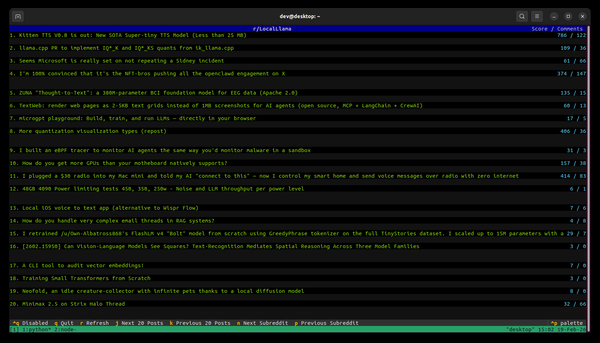
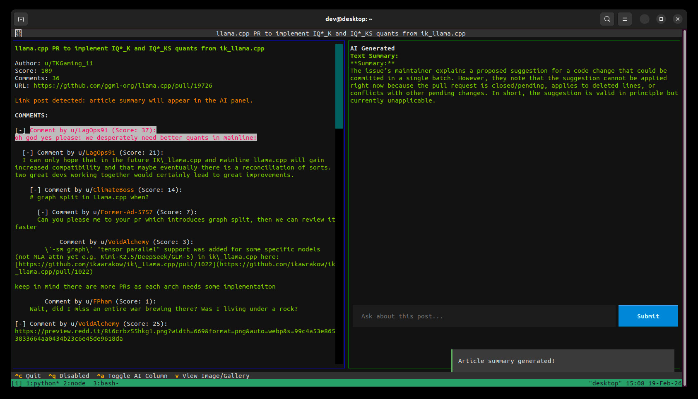

# Reddit Browser

A terminal-based TUI for browsing Reddit & HackerNews built with Textual.

## Usage

```bash
python app.py [subreddit]
```

Defaults to `r/LocalLlama` if no subreddit is specified.
Set the subreddit to `news.ycombinator.com` to browse Hacker News.

## Prerequisites

Run in a real terminal environment (not in IDE terminals that don't properly handle input). The TUI requires a proper terminal to handle keyboard input.

## Installation

Install dependencies:
```bash
pip install -r requirements.txt
```

For AI features (optional):
```bash
pip install openai
export OPENROUTER_API_KEY="your-api-key-here"
```

## Controls

- `j`/`k`: Navigate posts
- `r`: Refresh
- `q`: Quit
- `Enter`: Open post
- Numbers: Jump to specific post
- `j`/`k` in comments: Navigate comment pages
- `↑`/`↓` in comments: Select comments
- `+`/`-` in comments: Expand/collapse comments
- `v` in comments: View image in GUI viewer
- `ESC` in comments: Return to post list

## Notes

- Uses OpenRouter for AI features via the OpenAI client.
- `scripts/copy_firefox_twitter_cookies.sh` auto-detects Firefox profiles in `~/.mozilla/firefox` and Snap installs; you can override with `FIREFOX_PROFILE_ROOT`.

## Screenshots

### Main View



### Article View



## Twitter / Twikit Notes

- Twitter support uses `twikit` with a local `cookies.json` session file.
- Log in to Twitter/X in Firefox first (same machine/account/network), then export cookies for Twikit use.
- `cookies.json` is ignored by git and should be treated like a secret session token.

Copy Firefox Twitter cookies into the current working directory as `cookies.json`:
```bash
./scripts/copy_firefox_twitter_cookies.sh
```

If your Firefox profile path is custom, set `FIREFOX_PROFILE_ROOT`:
```bash
FIREFOX_PROFILE_ROOT="$HOME/.mozilla/firefox" ./scripts/copy_firefox_twitter_cookies.sh
```

Quick cookie auth test:
```bash
python scripts/test_twikit_cookies.py --cookies-file cookies.json --check timeline
```
